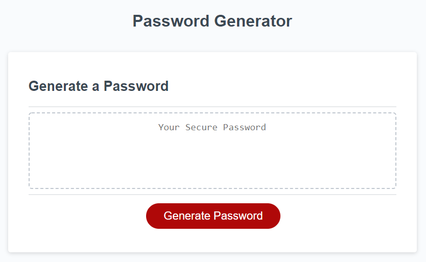

# bootcamp-week3-hw

Password Generator to generate random passwords based on the follow user input:

<ul>
  <li>Character Length (between 8-128)</li>
  <li>The option to include upper case characters</li>
  <li>The option to include lower case characters</li>
  <li>The option to include special characters</li>
  <li>The option to include numbers</li>
</ul>

The user must pick at least option for the generator to work.

Link to deployed app: https://mslee001.github.io/bootcamp-week3-hw/

Screenshot of password generator

